# ModelSketchBook — Getting Started

[Paper](https://hci.stanford.edu/publications/2023/Lam_ModelSketching_CHI23.pdf) |
[DOI](https://doi.org/10.1145/3544548.3581290) | 
[Video](https://youtu.be/-zaeXENVTfk) |
[Sample NB](https://github.com/StanfordHCI/ModelSketchBook/blob/main/example_nb/23_04_ModelSketchBook_example.ipynb) | 
<a target="_blank" href="https://colab.research.google.com/github/StanfordHCI/ModelSketchBook/blob/main/example_nb/23_04_ModelSketchBook_example.ipynb">
  
</a>

<p align="center">

</p>

**ModelSketchBook** is a Python package introduced as part of an ACM CHI 2023 paper:

**Model Sketching: Centering Concepts in Early-Stage Machine Learning Model Design**.
*Michelle S. Lam, Zixian Ma, Anne Li, Izequiel Freitas, Dakuo Wang, James A. Landay, Michael S. Bernstein*.
Proceedings of the 2023 CHI Conference on Human Factors in Computing Systems (CHI '23).
[PDF](https://hci.stanford.edu/publications/2023/Lam_ModelSketching_CHI23.pdf) | [Arxiv](https://arxiv.org/abs/2303.02884)

## tl;dr
Machine learning practitioners often end up tunneling on **low-level technical details** like model architectures and performance metrics. Could early model development instead focus on **high-level questions of which factors a model ought to pay attention to**? ModelSketchBook instantiates a vision of **model sketching**, a technical framework for rapidly iterating over a machine learning model's decision-making logic. Model sketching refocuses practitioner attention on **composing high-level, human-understandable concepts** that the model is expected to reason over (e.g., profanity, racism, or sarcasm in a content moderation task) using zero-shot concept instantiation.


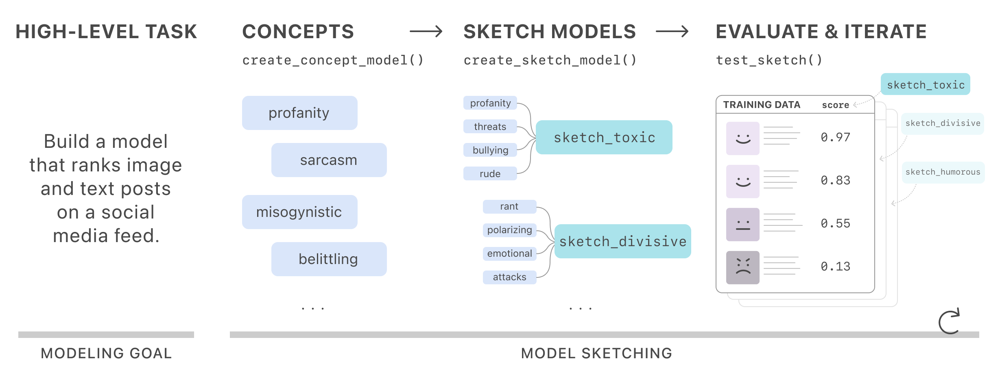

With **ModelSketchBook**, you can **create concepts** using zero-shot methods,

<p align="center">

</p>

**create sketches** that combine these concept building blocks,
<p align="center">

</p>

and continue to iterate on concepts and sketches to explore the ML model design space before diving into technical implementation details.

> 🚧 This repo is a work-in-progress research prototype and will continue to be updated! It has not yet been tested in a wide variety of development setups, but see our [sample Colab notebook](https://colab.research.google.com/github/StanfordHCI/ModelSketchBook/blob/main/example_nb/23_04_ModelSketchBook_example.ipynb) for a working example.

## Installation
First, you'll need to install this [package](https://pypi.org/project/model-sketch-book/) using PyPI.
```
pip install model_sketch_book
```

## 1: Basic setup
### Imports
Then import the package into a Python notebook (i.e., a Jupyter or Colab notebook).
```
import model_sketch_book as msb
```

### Set up the sketchbook
**Data**. ModelSketchBook is designed to work with datasets in Pandas DataFrame format. You can load CSVs to dataframes using the Pandas [`read_csv` function](https://pandas.pydata.org/docs/reference/api/pandas.read_csv.html).

**Schema**. To set up your sketchbook, you need to specify the schema of your dataframe.
In the schema, the **keys** are the string names of the columns in your dataframe that you'd like to use, and the **values** indicate the type of data contained in that column. The currently-supported input types are:

- `InputType.Text`: (string) Raw text fields of arbitrary length. Strings may be truncated to a max token length for prompts to GPT.
- `InputType.Image`: (string) URLs to remotely-hosted images. 
- `InputType.ImageLocal`: (string) Filepaths to locally-stored images.
- `InputType.GroundTruth`: (float or bool) Ground truth labels. Currently expected to be in the domain [0, 1].

**Ground truth**. The current API version requires exactly one ground truth column in the schema, though you can later add datasets that don't contain this ground truth column.

**Credentials**. Please supply your own OpenAI organization and API key if you would like to use GPT-based concepts. Otherwise, you can provide empty strings.

```
sb = msb.create_model_sketchbook(
    goal='Example sketchbook goal here',
    schema={
        # Specify your data schema here
        "picture_url": msb.InputType.Image,
        "neighborhood_overview": msb.InputType.Text,
        "description": msb.InputType.Text,
        "overall_rating": msb.InputType.GroundTruth,  # Required
    },
    credentials={
        "organization": "org-INSERT",
        "api_key": "sk-INSERT"
    }
)
```

### Add your dataset(s)
Then, add your dataset from a Pandas dataframe (recommended: 40-50 rows). If the dataframe contains images, this step will involve caching the images to speed up processing later. 

You should also specify exactly one dataset to be the **default dataset** with the `default` argument. It's recommended that your **training set** be the default dataset. With the notebook-widget functions documented here, the default dataset is used to set up concepts and sketches, and other datasets can only be used to evaluate trained sketches.
```
your_df = pd.read_csv("path_to_your_data/data.csv") # Insert logic to load your dataframe

sb.add_dataset(
    df=your_df,
    default=True,  # If dataset should be used by default, otherwise omit argument
)
```

### Create concepts
You can then go ahead and create image and text concepts with the following function. This function will display widgets to specify your concept term, input field, and output type.
```
msb.create_concept_model(sb)
```

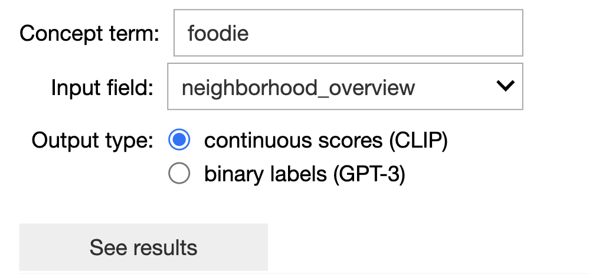

**Models**. Currently, text concepts can be served by GPT-3 (using the `text-davinci-002` model) or OpenCLIP (using the `ViT-B-32-quickgelu` model), and image concepts can only be served by OpenCLIP.

### Create sketches
Then, you can combine concepts together into sketches with the following function. This function will display widgets to select concepts and an aggregator.
```
msb.create_sketch_model(sb)
```

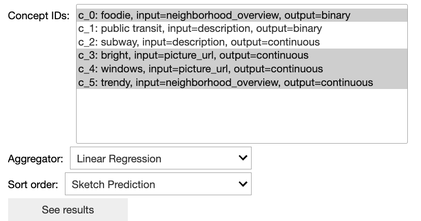

## 2: Other functions
### Tune concepts (optional)
You may optionally tune your existing concepts by binarizing them at a threshold, normalizing the values, or calibrating them between specified values. This function will display widgets to select an existing concept, a tuning method, and tuning-related parameters.
```
msb.tune_concept(sb)
```

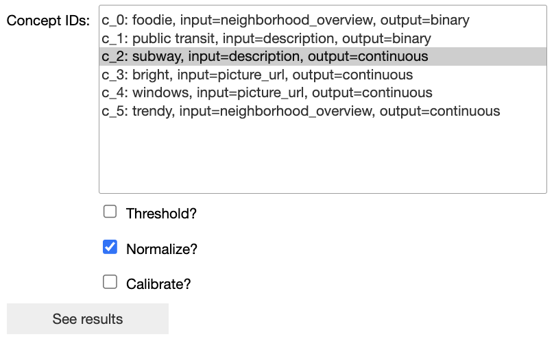

### Logical concepts (AND, OR)
Logical concepts can be applied to any number of existing binary concepts. This function will display widgets to select the concepts and the logical operator (AND or OR) to apply to those concept scores.
```
msb.create_logical_concept_model(sb)
```

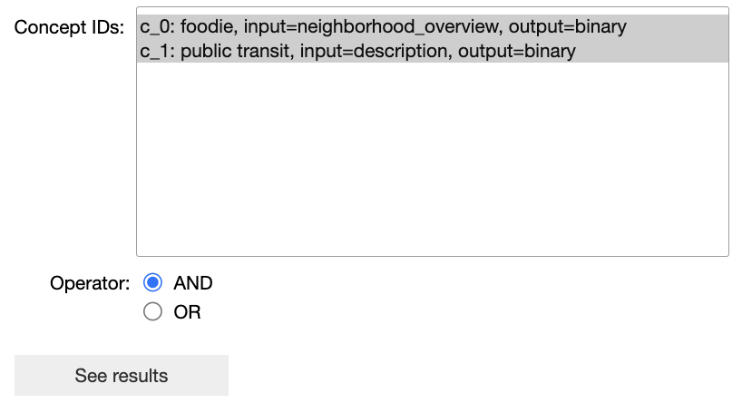

### Keyword concepts
Keyword concepts can be applied to any text-based input fields. The text of each example will be compared to the specified list of keywords, and if any of the keywords appear in the example, the example will be given a positive (True) label. This function will display widgets to select the input field and the comma-separated list of keywords, which can be treated in a case-sensitive or case-insensitive manner.
```
msb.create_keyword_concept_model(sb)
```

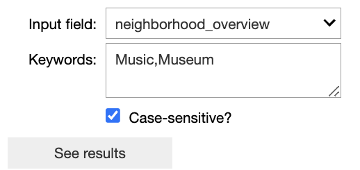

### Take notes
You can select from among your created concepts and sketches and enter free-text notes into the text field. These notes will be displayed with your concept or sketch in calls to `show_concepts()` or `show_sketches()`.
```
msb.take_note(sb)
```

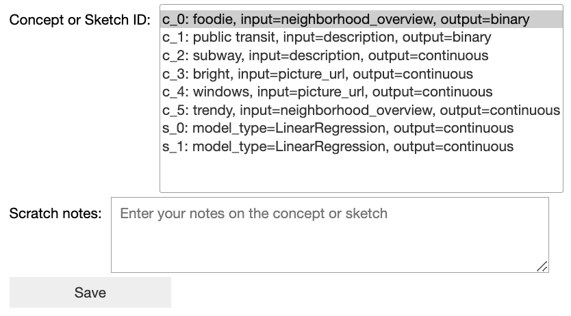

## 3: Concept helper functions
### View existing concepts
Prints out a summary of all existing concepts with concept ID, concept term, input field, output type, and associated notes (if provided).
```
msb.show_concepts(sb)
```

### Get concept term suggestions
Prints a set of synonyms for the provided concept term to assist in term ideation. Currently surfaced using [WordNet](https://wordnet.princeton.edu/) synsets.
```
msb.get_similar_concepts("your concept term")
```

### Compare concepts to ground truth labels
This function displays the Pearson correlation coefficients between each of the selected concepts and the ground truth label column. It also displays a table view that shows the difference between the concept score and ground truth label for each example in the default dataset.
```
msb.compare_concepts_to_gt(sb)
```

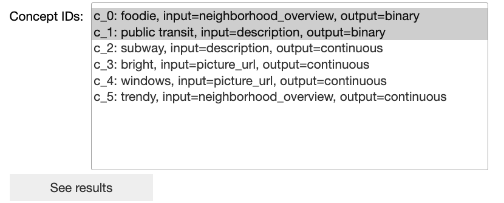

### Compare concepts to each other
This function displays the Pearson correlation coefficients between the two selected concepts. It also displays a table view that shows the difference between the concept scores for each example in the default dataset.

```
msb.compare_two_concepts(sb)
```

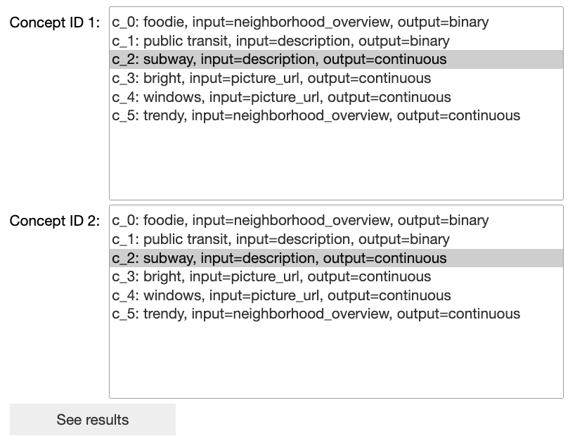

## 4: Sketch helper functions
### View existing sketches
Prints out a summary of all existing sketches with sketch ID, model type, output type, concepts, and associated notes (if provided).
```
msb.show_sketches(sb)
```

### Test an existing sketch on a dataset
Runs a selected (trained) sketch model on the selected dataset.
```
msb.test_sketch(sb)
```

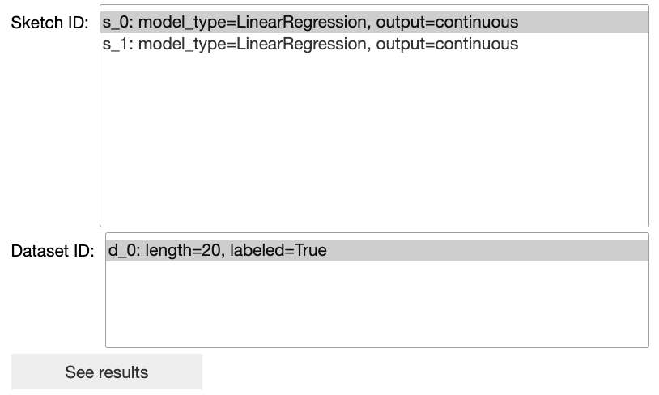

### Compare sketch performance
Plots performance metrics (Mean Absolute Error, F1 Score, Classification accuracy, precision, and recall) for all of the selected sketches on the specified dataset.
```
msb.compare_sketches(sb)
```

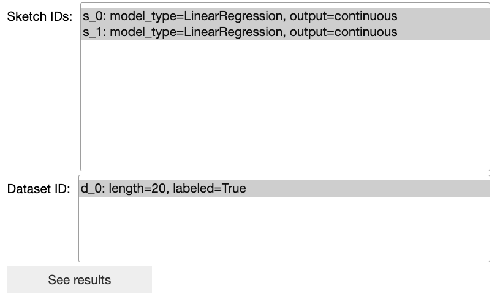


## Contributing

Interested in contributing? Check out the contributing guidelines. Please note that this project is released with a Code of Conduct. By contributing to this project, you agree to abide by its terms.

## License

`model_sketch_book` was created by Michelle Lam. It is licensed under the terms of the MIT license.

## Credits

`model_sketch_book` was created with [`cookiecutter`](https://cookiecutter.readthedocs.io/en/latest/) and the `py-pkgs-cookiecutter` [template](https://github.com/py-pkgs/py-pkgs-cookiecutter).
